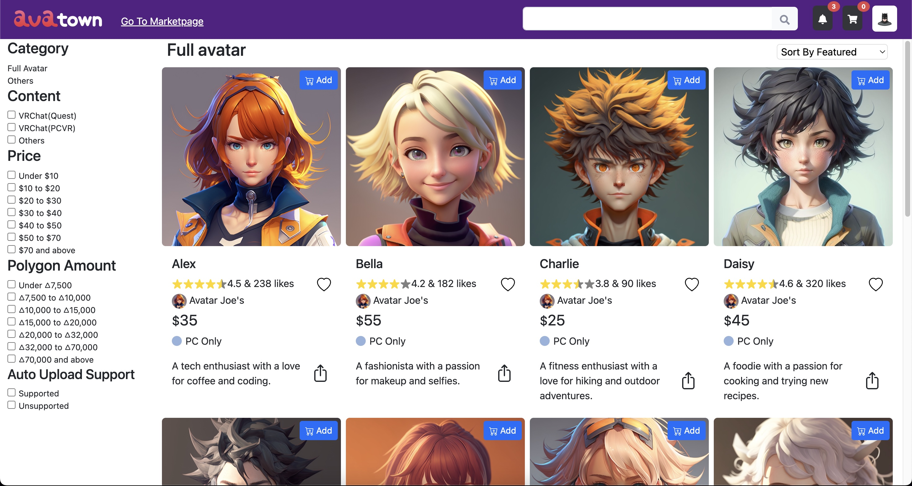
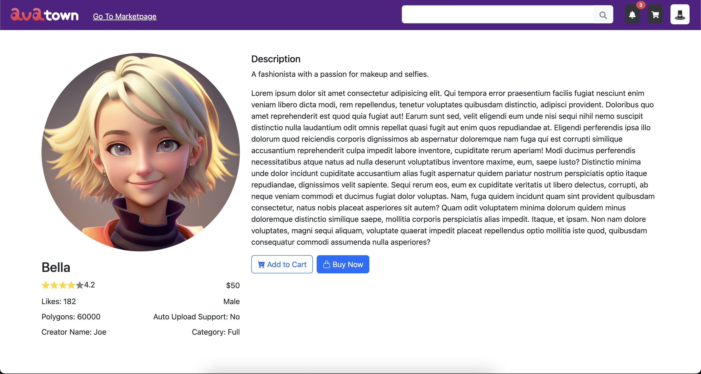

# Avatown Dolami, Inc Frontend-Engineer Coding Test( React.js )
#### Samss Jubair, Software Developer, Dhaka Bangladesh

## live url https://644e54cf62fef5453dba34e3--avatown-sj.netlify.app

## How to run the project locally

1. Clone the repository
1. Open the terminal and navigate to the project directory
1. Run `npm install` to install the dependencies
1. Run `npm run dev` to start the project

## Packages used
1. bootstrap (for styling)
2. react-bootstrap (for bootstrap components)
3. react-router-dom (for routing)
4. react-icons (for icons)
5. react-rating-stars (for rating stars)
6. react-heart (for heart icon)
used boilerplate from their websites

## Pages
1. Home page (/)
2. Avatar details page (/avatarname)

## json
- using help of chatgpt

## screenshots

### Home page

### Avatar details page

